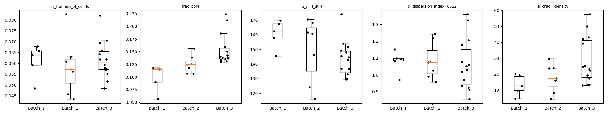
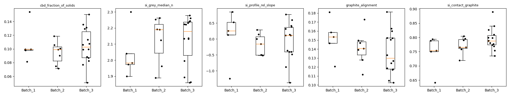
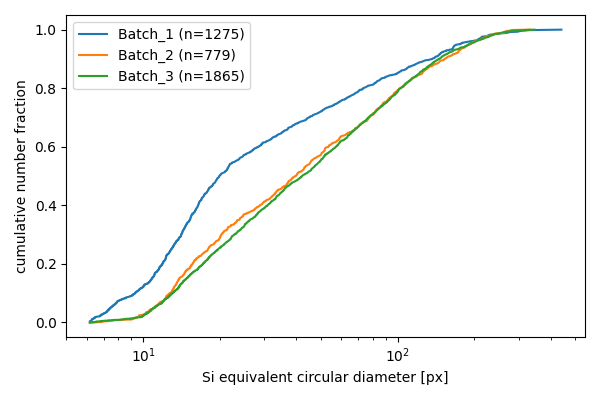
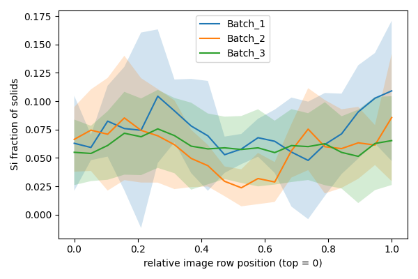

# Si / graphite anode QC report (BSE + ETD + Inlens)

Images: 31 (26 without trust flags; flagged images are excluded from batch statistics). Size unit: **px** (pixel size unknown: sizes are in pixels).

## Key QC KPIs (batch medians, all images)

Ranked by importance for QC decisions. *Pixel width*: KPI range allowed by noise and edge blur. *Algorithm width*: 5th-95th percentile over reruns with plausible settings. *Main driver*: the setting that moves the KPI most. See `docs/KPI_SPEC.md` for definitions.

| rank | kpi | column | Batch_1 | Batch_2 | Batch_3 | pixel width (median) |
|---|---|---|---|---|---|---|
| 1 | Si fraction of solids | si_fraction_of_solids | 0.0658 | 0.0572 | 0.0593 | 0.021 |
| 1 | Si fraction of solids | si_wt_pct_estimate | 6.77 | 5.89 | 6.11 | 2.2 |
| 2 | Porosity + gradient | frac_pore | 0.115 | 0.124 | 0.143 | 0.077 |
| 2 | Porosity + gradient | porosity_profile_rel_slope | -0.0571 | -0.108 | 0.127 | 0.074 |
| 3 | Si coarse tail D90 (D50) | si_ecd_d90 | 158 | 161 | 145 | 16 |
| 3 | Si coarse tail D90 (D50) | si_ecd_d50 | 38.6 | 39.8 | 42.9 | 13 |
| 4 | Si agglomeration | si_dispersion_index_w512 | 1.1 | 1.07 | 1.06 | 0.023 |
| 4 | Si agglomeration | si_clustering_index | 1.16 | 1.21 | 1.17 | 0.084 |
| 5 | Cracks + Si debonding | si_crack_density | 18.7 | 17.4 | 22.2 | 32 |
| 5 | Cracks + Si debonding | graphite_crack_density | 47.7 | 51.4 | 67.2 | 4.1 |
| 5 | Cracks + Si debonding | si_debond_fraction | 0.000259 | 0.000211 | 0.00016 | 0.0069 |
| 6 | Binder/carbon-black + gradient | cbd_fraction_of_solids | 0.0996 | 0.0993 | 0.0995 | 0.01 |
| 6 | Binder/carbon-black + gradient | cbd_profile_rel_slope | -0.236 | -0.0472 | -0.064 | 0.027 |
| 7 | Si material fingerprint | si_grey_median_n | 1.97 | 2.19 | 2.19 | 0.02 |
| 8 | Si top-to-bottom gradient | si_profile_rel_slope | 0.255 | -0.16 | 0.11 | 0.059 |
| 9 | Graphite alignment | graphite_alignment | 0.147 | 0.141 | 0.147 | 0.013 |
| 10 | Si contact | si_contact_graphite | 0.751 | 0.766 | 0.788 | 0.28 |
| 10 | Si contact | si_contact_cbd | 0.226 | 0.219 | 0.196 | 0.14 |
| 10 | Si contact | si_contact_pore | 0.00392 | 0.00392 | 0.00919 | 0.15 |
| 10 | Si contact | si_contact_gap | 0.00649 | 0.00395 | 0.00425 | 0.01 |

## Is a batch difference robust to algorithm choices?

Share of algorithm runs in which the Kruskal-Wallis test across batches gives p < 0.05. Robust only if >= 95 % of runs agree.

Algorithm Monte Carlo not run (`--mc-runs`).

## Batch differences with the default settings (Kruskal-Wallis, trusted images)

| kpi | statistic | p_value |
|---|---|---|
| si_fraction_of_solids | 1.176 | 0.5555 |
| si_wt_pct_estimate | 1.176 | 0.5555 |
| frac_pore | 13.69 | 0.001066 |
| porosity_profile_rel_slope | 4.57 | 0.1018 |
| si_ecd_d90 | 4.915 | 0.08566 |
| si_ecd_d50 | 1.086 | 0.5811 |
| si_dispersion_index_w512 | 0.9365 | 0.6261 |
| si_clustering_index | 0.8044 | 0.6688 |
| si_crack_density | 6.351 | 0.04178 |
| graphite_crack_density | 12.96 | 0.001536 |
| si_debond_fraction | 0.3692 | 0.8314 |
| cbd_fraction_of_solids | 0.7106 | 0.701 |
| cbd_profile_rel_slope | 1.023 | 0.5995 |
| si_grey_median_n | 0.5663 | 0.7534 |
| si_profile_rel_slope | 1.977 | 0.3722 |
| graphite_alignment | 1.701 | 0.4272 |
| si_contact_graphite | 3.569 | 0.1679 |
| si_contact_cbd | 4.769 | 0.09211 |
| si_contact_pore | 6.034 | 0.04894 |
| si_contact_gap | 1.566 | 0.457 |
| si_clustering_index | 0.8044 | 0.6688 |

Pairwise Mann-Whitney tests with Cliff's delta are in `kpis/batch_stats.csv`. With 7-17 images per batch, treat p-values as indicative only.

## Per-image values with intervals (top 3 KPIs)

`value [pix lo–hi] [alg p5–p95] (main driver)`

| batch | image_id | si_fraction_of_solids | frac_pore | si_ecd_d90 |
|---|---|---|---|---|
| Batch_1 | img_4ih2ggld | 0.101 [pix 0.0843–0.12] | 0.131 [pix 0.101–0.165] | 109 [pix 109–139] |
| Batch_1 | img_5n1q8atc | 0.111 [pix 0.0956–0.128] | 0.0674 [pix 0.0484–0.0892] | 112 [pix 112–141] |
| Batch_1 | img_f1vzngrs | 0.0679 [pix 0.0584–0.0784] | 0.0564 [pix 0.0358–0.0813] | 168 [pix 160–177] |
| Batch_1 | img_ffwubibz | 0.0484 [pix 0.0405–0.0572] | 0.0897 [pix 0.0627–0.121] | 146 [pix 139–155] |
| Batch_1 | img_fzrt2k6r | 0.0639 [pix 0.0537–0.0753] | 0.116 [pix 0.0843–0.152] | 162 [pix 155–173] |
| Batch_1 | img_iv6g2oq0 | 0.0591 [pix 0.0498–0.0698] | 0.118 [pix 0.0849–0.154] | 158 [pix 158–176] |
| Batch_1 | img_uhdslk0o | 0.0658 [pix 0.0567–0.0762] | 0.115 [pix 0.0817–0.152] | 170 [pix 170–193] |
| Batch_2 | img_3806gxp0 | 0.0631 [pix 0.0533–0.0741] | 0.138 [pix 0.102–0.179] | 168 [pix 167–179] |
| Batch_2 | img_avn74qx1 | 0.0458 [pix 0.0385–0.0539] | 0.118 [pix 0.087–0.151] | 124 [pix 120–132] |
| Batch_2 | img_b3esycq1 | 0.0826 [pix 0.0699–0.0968] | 0.124 [pix 0.0916–0.16] | 170 [pix 166–184] |
| Batch_2 | img_epqdaau9 | 0.0608 [pix 0.0513–0.0715] | 0.106 [pix 0.0741–0.144] | 162 [pix 160–170] |
| Batch_2 | img_i9jiqjwl | 0.0562 [pix 0.0477–0.0661] | 0.106 [pix 0.0754–0.141] | 146 [pix 140–155] |
| Batch_2 | img_r17byphk | 0.0435 [pix 0.0359–0.0523] | 0.156 [pix 0.118–0.199] | 116 [pix 110–131] |
| Batch_2 | img_rxax5ozo | 0.0572 [pix 0.0479–0.0677] | 0.125 [pix 0.0897–0.164] | 161 [pix 161–176] |
| Batch_3 | img_0grcilhi | 0.0579 [pix 0.0479–0.0693] | 0.223 [pix 0.181–0.268] | 148 [pix 138–159] |
| Batch_3 | img_71vgq3fw | 0.0659 [pix 0.0551–0.0785] | 0.137 [pix 0.0982–0.181] | 154 [pix 148–162] |
| Batch_3 | img_9luzk4jm | 0.0694 [pix 0.0574–0.0833] | 0.186 [pix 0.142–0.233] | 146 [pix 139–161] |
| Batch_3 | img_cfe5vt7s | 0.0618 [pix 0.0521–0.0731] | 0.129 [pix 0.0923–0.17] | 174 [pix 174–183] |
| Batch_3 | img_hawkfj64 | 0.0461 [pix 0.0375–0.0559] | 0.154 [pix 0.114–0.197] | 112 [pix 110–121] |
| Batch_3 | img_hzumfsms | 0.0574 [pix 0.0474–0.0689] | 0.212 [pix 0.169–0.257] | 133 [pix 127–143] |
| Batch_3 | img_kbdh4tri | 0.0552 [pix 0.0455–0.0664] | 0.136 [pix 0.0967–0.18] | 137 [pix 137–155] |
| Batch_3 | img_mgxahqnk | 0.0739 [pix 0.0631–0.0864] | 0.154 [pix 0.114–0.199] | 189 [pix 184–202] |
| Batch_3 | img_pl8uabbv | 0.0593 [pix 0.0484–0.0717] | 0.135 [pix 0.0991–0.176] | 129 [pix 125–145] |
| Batch_3 | img_ptg8lmto | 0.0571 [pix 0.047–0.0686] | 0.131 [pix 0.0933–0.173] | 130 [pix 127–143] |
| Batch_3 | img_tuy3zymq | 0.0484 [pix 0.0392–0.059] | 0.159 [pix 0.116–0.206] | 130 [pix 127–141] |
| Batch_3 | img_ufdvpb81 | 0.0516 [pix 0.0429–0.0618] | 0.138 [pix 0.102–0.177] | 145 [pix 139–155] |
| Batch_3 | img_utfgcjfa | 0.0618 [pix 0.0517–0.0735] | 0.15 [pix 0.112–0.192] | 152 [pix 152–173] |
| Batch_3 | img_vc2whyaq | 0.0642 [pix 0.0534–0.0764] | 0.14 [pix 0.103–0.18] | 149 [pix 147–162] |
| Batch_3 | img_x77cy643 | 0.0706 [pix 0.0586–0.0843] | 0.143 [pix 0.104–0.185] | 143 [pix 140–154] |
| Batch_3 | img_x7u69zsw | 0.0821 [pix 0.0695–0.0969] | 0.134 [pix 0.0953–0.176] | 137 [pix 135–150] |
| Batch_3 | img_xgj4xftb | 0.0552 [pix 0.0469–0.065] | 0.17 [pix 0.128–0.215] | 165 [pix 164–177] |

## Si particle size distribution (particles touching the image border excluded)

## Si fraction vs image row (through-thickness only if rows run through the electrode)

## Trust flags

| batch | image_id | trust_flags |
|---|---|---|
| Batch_1 | img_4ih2ggld | low_si_contrast |
| Batch_1 | img_5n1q8atc | low_si_contrast |
| Batch_3 | img_hawkfj64 | charging |
| Batch_3 | img_mgxahqnk | charging |
| Batch_3 | img_xgj4xftb | charging |

## Caveats

- `si_wt_pct_estimate` assumes pure Si (2.33 g/cm3) vs graphite + binder (2.26 g/cm3); invalid for SiOx/Si-C.
- Sizes are 2D, number-weighted equivalent circular diameters; not comparable with laser-diffraction D50/D90.
- Si grey level is a relative change flag, only comparable at identical microscope settings; it does not identify SiOx without calibration / EDS.
- Binder/carbon-black is a texture-based class (experimental): rough graphite surfaces can still be counted and smooth binder missed.
- Pores recessed below the surface but not black in ETD are undercounted.
- Gradients assume image rows run through the electrode thickness, which is not confirmed.
- Not quantified: field-of-view sampling, physical-model assumptions, bias against ground truth.
